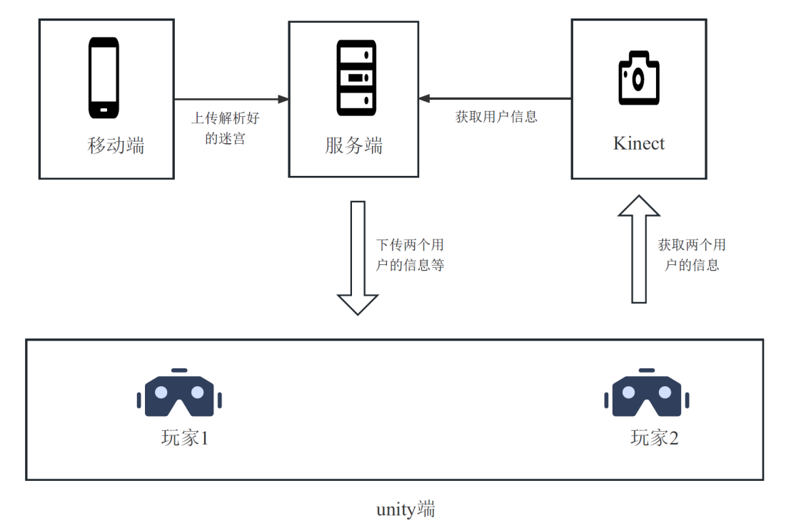
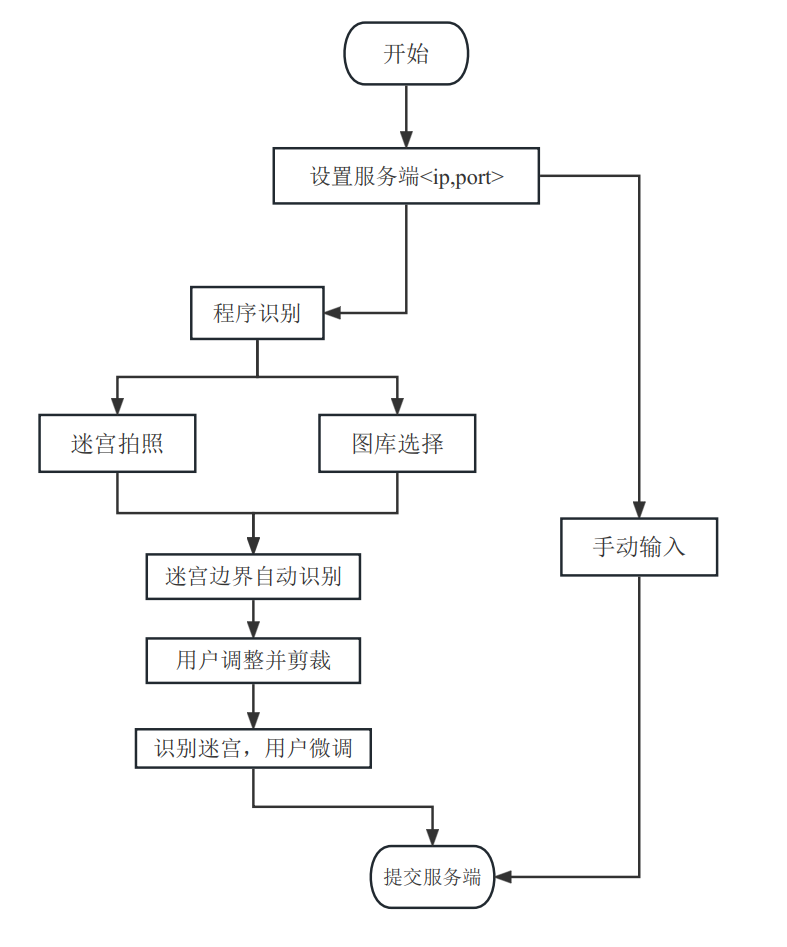
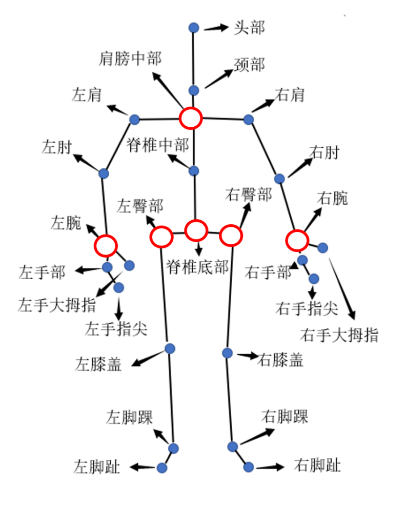
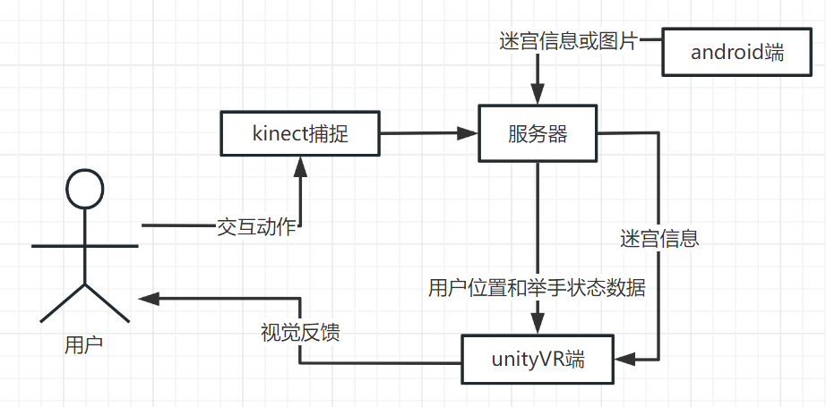
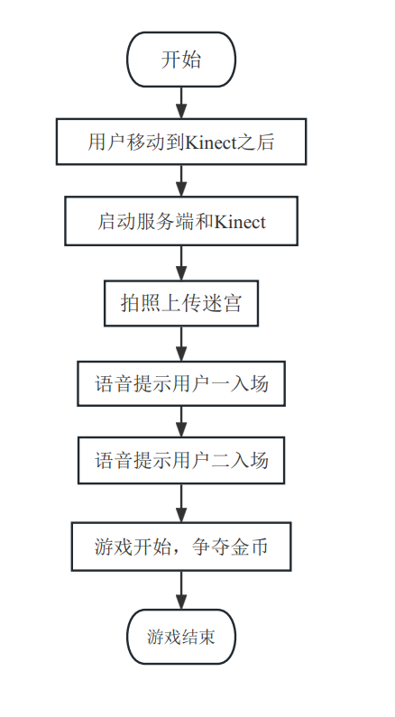
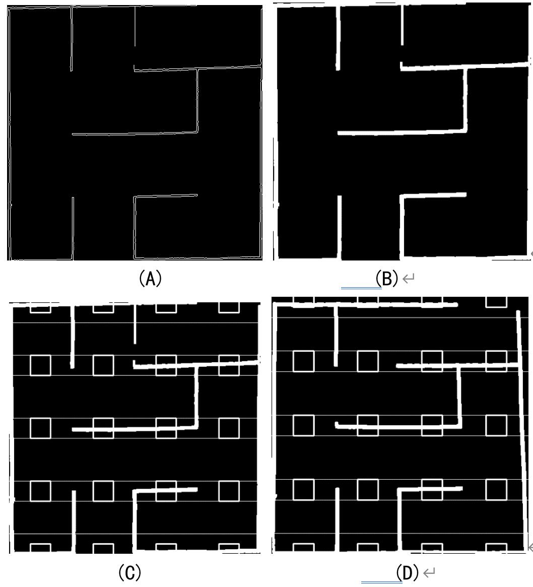
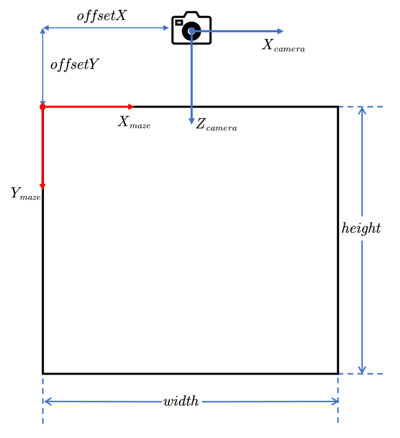

# VR-maze

## 1.   系统架构与实现

如下图所示，该系统分成四个板块：服务端，移动端，Kinect端和Unity端。抽象出服务端的目的是，将任务进行分解，避免Kinect端与unity端直接通信、移动端和unity端直接通信，降低程序耦合程度，方便调试与后期需求变更。其中服务端的功能是接收来自移动端传递的解析完成的迷宫、解析Kinect端数据将数据直接映射成unity端可以直接使用的数据；移动端的功能是完成迷宫的解析与上传工作；unity端的功能是通过接收服务端传递的用户位置等信息进行视角切换。



### 1.1 移动端

  移动端是Android app，如下图所示，展示了迷宫提取APP的流程图。流程为：

- 第一次使用时需要配置与服务端通信的IP和Port
- 用户接下来有两种选择迷宫上传方式，第一种是手动输入并提交，第二种是由程序识别，下面介绍第二种算法
- 迷宫的图片源支持拍照或者从图库中选择
- 选择出图片之后，应用边缘检测等算法我们预测出迷宫的边界，并提示用户进行微调，用户完成微调之后，将使用透视变换进行图片校正
- 校正后的图片继续使用边缘检测、形态学处理等算法识别出迷宫整体结构，并提示用户进行微调
- 用户完成微调之后，上传到服务端，至此移动端功能结束



### 1.2 服务端

服务端采用python实现，功能是与移动端、Kinect、Unity端建立通信连接，它们之间两两不进行通信，通信通过服务端的处理实现。服务端将这些通信分成三个进程运行，在run.py中并行运行这三个进程。同时在**config.json**文件中，可以对IP地址、端口、迷宫参数进行配置。同时服务端具有统筹游戏进程的功能，过程中采用语音提示进行控制。

### 1.3 Kinect端

如下图所示，我们一共选择了5个关键点用于位置和姿势解析。其中左臀部、右臀部、脊椎底部关节点用于用户位置确认，我们选择这三个位置的平均值用于计算，因为人体的构造决定着左臀部、右臀部关节点关于脊椎底部关节点对称的，我们用三者的平均值来消除误差。选择肩膀中部、左腕、右腕关节点用于确认用户是否举手，判定方式为当左腕或右腕中有一处高于肩膀中部关节点即认为用户举手了，对于举那一只手、是否举起双手不做区分。



### 1.4 unity端

 Unity端实现对用户界面的显示。通过unity端，用户可以认识到自己的位置，获取对交互的提示。所有的改变都会反应在Unity上，unity可以动态改变墙面，动态改变用户位置。Unity端通过协程的方法，将一些计算放在了子线程，然后通过服务端获取的信息得到用户位置和用户的举手情况，从而对显示的内容进行改变，视角的改变是通过陀螺仪由XR plugin实现的。这里网络通信是通过广播获取服务器Ip，然后进行通信，所以不需要考虑用户手动填写网络ip和端口。



## 2.   交互设计

### 2.1 一次完整的交互流程

如下图所示，展示了一次完整的用户交互过程的流程，下面对每一处过程中的细节进行描述：

- 用户用胶带或其他标志搭建出迷宫的框架
- 运行起python的服务端之后，会有语音提示所有用户移动到Kinect之后，这是避免无关的用户干扰Kinect对玩家的识别
- 接着使用移动端的迷宫扫描工具对迷宫进行拍照识别，上传到服务器进行缓存
- 两个玩家启动Unity端，服务端运行后，会一直广播自己的<IP, port>，这样玩家无需进行额外的设置即与服务器建立了连接
- Unity连接后便开始与服务端进行通信，在第一次通信的时候会拿到服务端缓存的迷宫的相关信息，进行迷宫渲染
-  这时候服务端会语音提醒玩家一进入迷宫中去，当玩家一进入后，再提醒玩家二进入，这样对两个玩家进行了区分
- 然后服务端语音提示游戏开始
- 之后的Unity端和服务端的通信都是为了得到两个玩家的坐标和举手信息
- 玩家在金币附近举手会得到这个金币，玩家需要得到尽可能多的金币并走出迷宫



### 2.2 迷宫设计

对于迷设计宫而言，我们采用的是动态方案。因为考虑到场景的要求，我们使用安卓端，要么拍照对相关物体(物理)进行解析（在服务器端进行解析，仅仅上传的是图片），要么通过手动输入，然后在服务器端将其解析为字符串，通过将字符串发送到unityVr端，通过解析最终呈现出来。

### 2.3 金币机制

考虑到多人交互的需求，我们讨论了很多思路，首先是我们设置金币，然后每个人获取金币数量汇总，然后通过服务器得到结果，判断胜负。但是这样不太好，因为用户没有至今反馈，只用最后才显示出来。所以我们通过使用争夺金币的手段来尝试。

夺金币指的是使用金币，每个金币的初始位置都是固定的，通过每个人到达相对金币的一定范围内，然后通过举手的方式表示自己要捡金币的动作。这样就捡到了金币，但是金币总量是有限的，所以这里会通知另一方，表示这个金币已经被抢夺，表现出来就是金币消失。

## 3.  交互技术和实现

### 3.1 通信机制

通信是以服务器为中心的，包括移动端与服务器的通信，Kinect端与服务端的通信，Unity端与服务端的通信，通信过程使用TCP Socket。因此需要将所有设备连接在同一个局域网下，经过测试可以使用手机热点，而校园网sdu_net有时候是不通的。在通信过程中为了，许多请求需要共用端口号，于是我们对传递的数据的格式进行了约束，如表1所示，描述了服务端的通信接口。

**表1：与服务端的通信接口描述**

| **请求源** | **功能描述**                                       | **格式**                                                     | **通信频率**                   |
| ---------- | -------------------------------------------------- | ------------------------------------------------------------ | ------------------------------ |
| 移动端     | 上传迷宫图片，要求返回解析结果                     | 0，图片的base64编码                                          | 游戏过程中只需要一次，可无限次 |
| 移动端     | 上传迷宫，并进行储存，在unity端连接后发送给unity端 | 1，迷宫编码（01串）  从上到下、从左至右，先横边再竖边对迷宫的边进行编号，然后存在的记录为0，不存在的记录为1 | 游戏过程中只需要一次，可无限次 |
| Kinect端   | 上传用户数据                                       | K#UID#20#6#10#12#16#0#+                                      | 无                             |
| Unity端    | 广播<IP,port>，用于告知unity端服务器的服务地址     | IP;Port                                                      | 一直广播                       |
| Unity端    | 请求两个用户的信息                                 | BX1,Y1,0/1，X2,Y2,0/1  其中0/1代表是否举手                   | 1次/秒                         |

### 3.2 迷宫识别

  该步骤是移动端的主要功能，算法实现分成两大步进行：

- 第一步识别出迷宫的边界并进行边界点推荐，然后应用透视变换算法进行剪裁，然后对所得图片进行下采样，应用base64编码，将图片以字符串的形式发送给服务端，服务端收到后进行转换成图片；

- 第二步将设计了迷宫提取算法，接着因为组成迷宫的部分是能与背景区分开的，因此会产生边缘，我们使用Canny边缘检测算子，然后进行二值化，得到如图(A)所示的结果；然后使用形态学膨胀操作，使得迷宫的边缘加厚，得到如图(B)所示的结果；如图(C)(D)所示，我们对迷宫的提取是通过分别判断横向边与纵向边的有无来确定，首先我们计算出每条边的理论中心，然后选择一个以其为中心的边框，判断其中是否存在一定量的白色色块，如果存在则表明这条边是存在的。

 

### 3.3 用户身份标识方法

在游戏过程中，Kinect会识别出两个玩家的位置、举手状态等信息，然后将这些数据传给对应的Unity端。Kinect对玩家的区分是进行编号，Unity端进行区分则是采用IP地址，困难之处在于IP地址需要与Kinect的编号对应起来。我们采用的对应方式是：

首先从外部得到两位玩家的IP地址，并在服务端的**config.json**文件中进行配置；然后开启服务端，这时候会语音提示所有玩家到Kinect之后，不然会造成误识别；然后两个用户打开Unity端，这时候服务器在一直广播自己的IP和Port，Unity端收到之后会与服务端建立连接，当连接第一次建立的时候，服务端会将迷宫传输给它们；然后玩家一首先进入到迷宫中去；服务端检测到后，将其认定为玩家一并且与IP地址进行绑定；接着会语音提示玩家二进入到迷宫中去；当检测到玩家二进入的时候，游戏开始。

### 3.4 金币机制实现

实现硬币的触发机制，首先确定硬币位置,为了方便交互，我们把金币位置固定，确保能正常在迷宫内。然后通过交互获取的用户位置，然后通过服务端将数据发送给各个vr端，vr端对接收到的数据进行处理。通过每个人到达相对金币的一定范围内，这里的一定范围是通过二维平面上的欧几里得距离公式，通过小于一定阈值即可，然后通过举手的方式表示自己要捡金币的动作，只有同时满足到达目的地，然后还有举手动作这两个机制才满足最终捡金币条件。

## 4.  系统部署

### 4.1 工具集Kinect配置

- 工具集_Data\StreamingAssets\IP_Server.txt下的端口，需要和Config.json文件中的kinect-port保持一致；

- 在工具中选择Kinect，并选择如下图所示的人体关键点，然后发送数据。

### 4.2 Config文件设置

**Config.json**文件是在服务端的配置文件，我们使用面向对象的思想将其抽象出来，这样当需要进行改动的时候不需要一个地方一个地方地去改，而是可以直接对**Config.json**文件进行修改。如图5所示，展示了**Config.json**文件下的配置。

```json
{
  "localhost": "192.168.43.108",
  "kinect-host": "127.0.0.1",
  "user1-ip": "192.168.43.232",
  "user2-ip": "192.168.43.1",
  "broadcast-ip": "192.168.43.108",

  "android-port": 9202,
  "kinect-port": 9999,
  "unity-port": 8888,
  "broadcast-port": 9060,

  "width": 2.4,
  "height": 2.4,
  "offsetX": 1.2,
  "offsetY": 1.2,
  "maze-size-width": 4,
  "maze-size-height": 4
}

```

如下图所示，描述了迷宫与Kinect之间的位置关系，其中$height,width$,分别表示迷宫的宽和高，$offsetX,offsetY$分别表示相机中心与迷宫左上角之间的偏移量。$maze-size-width$与$maze-size-height$描述迷宫是尺寸，例如若是$4，4$，则是描述一个$4*4$的迷宫。



User1-ip与user2-ip分别描述了两个玩家的Unity端的IP地址，这两个IP地址在连接上同一个局域网后可以进行查看。Android-port是与服务端与Android设备通信的端口，kinect-port是与工具集通信的端口，需要与工具集的配置文件中的端口保持一致。Unity-port是与unity端进行通信的端口。
